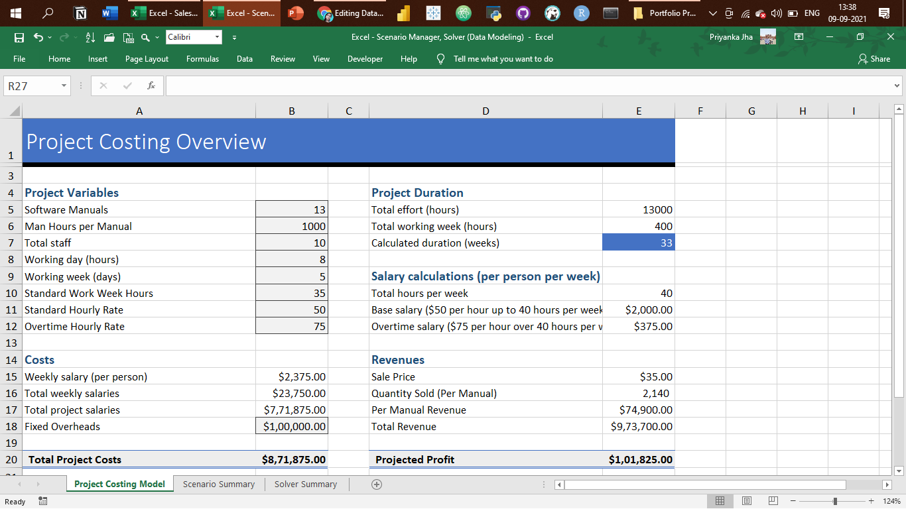
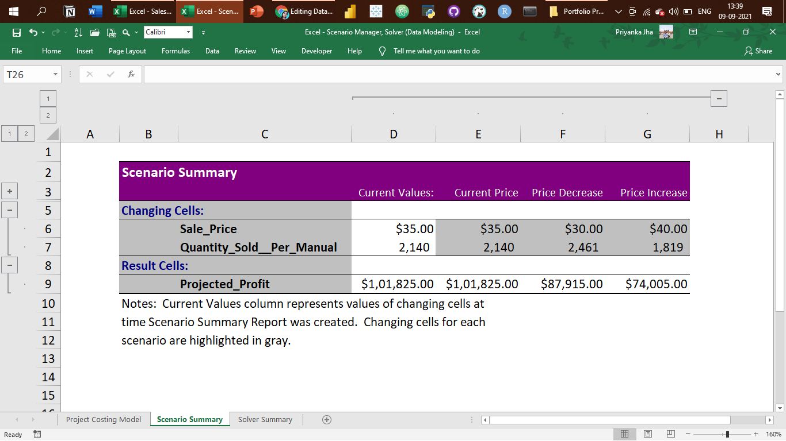

# SQL-Tableau-Portfolio

## Following are my projects in SQL & Tableau
#### *You can take a look at my personal website : [lufthik21.github.io](lufthik21.github.io)*  
#### *You can also take a look at my Linkedin : [Lufthi Kautsar](https://www.linkedin.com/in/lufthi-kautsar-946a0686/)*  

- [x] **SQL & Tableau** - 
  - Instagram Clone Data Analysis Project 
*See on Tableau Public:* **[Dashboard](https://public.tableau.com/views/InstagramDummyDataDashboard/InstagramCloneDataAnalysisDashboard?:language=en-GB&:display_count=n&:origin=viz_share_link)** 
*Review the Data Insertion SQL Script:* **[HERE](https://github.com/lufthik21/SQL-Tableau-Portfolio/blob/main/Instagram%20Clone%20SQL%20-%20Database%20%26%20Inserting%20Data.sql)** 
*Review the Data Exploration SQL Script:* **[HERE](https://github.com/lufthik21/SQL-Tableau-Portfolio/blob/main/Instagram%20Clone%20SQL%20-%20Exploratory%20Data%20Analysis.sql)** 

- [x] **SQL** - 
  - Nashville Housing Dataset: Data Cleaning  
*Review the SQL Script:* **[HERE](https://github.com/lufthik21/SQL-Tableau-Portfolio/blob/main/SQL%20-%20Data%20Cleaning.sql)** 

  - COVID-19 Dataset: Data Exploration   
*Review the SQL Script:* **[HERE](https://github.com/lufthik21/SQL-Tableau-Portfolio/blob/main/SQL%20-%20Data%20Exploration.sql)** 

- [x] **Tableau** - 

*To view these Tableau Dashboards in Tableau Public, click on the hypertext link.*

- E-commerce Sales Dashboard: https://public.tableau.com/views/E-CommerceSales-Dashboard/ExploratoryVisualAnalysis?:language=en-GB&:display_count=n&:origin=viz_share_link

- Sales SuperStore Deep Data Analysis (5 Dashboards): https://public.tableau.com/views/SuperStoreDataDashboards/1KPIDashboard?:language=en-GB&:display_count=n&:origin=viz_share_link 
      
      1 KPI Dashboard

      2 Top-Down Dashboard
      

      3 Q&A Dashboard
      

      4 Bottom-Up Dashboard
      

      5 Geo Chart
      

- London Bus Safety Dashboard: https://public.tableau.com/views/LondonBusSafetyDashboard_16605383232570/ChartsDashboard?:language=en-GB&:display_count=n&:origin=viz_share_link 

- [x] **Excel** - 

*Kindly download these Excel files from this repository and view them in Microsoft Excel.*

- Sales Superstore Sample: Sales Performance Dashboard  

- NetTRON Network Infrastructure Data : LOOKUP, INDEX, MATCH, SUMIFS  

- Shipping Data: Pivot Tables, Pivot Chart, Slicers  

- Project Costing Model Data: Scenario Manager, Solver (Data Modeling)

